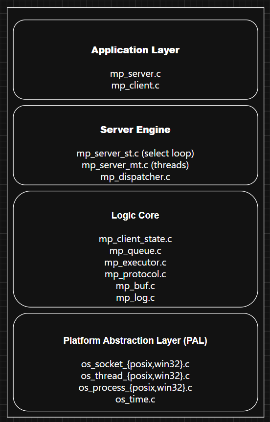
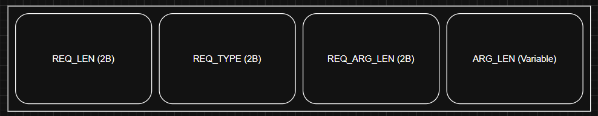
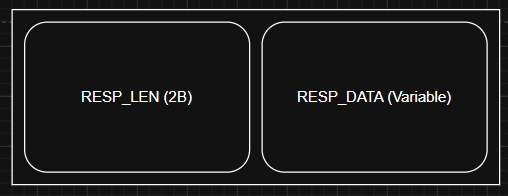

===== README.md =====

```markdown
# msgpass — Server-Client Message Passing System

A cross-platform command execution server and client written in C11.
The server accepts binary requests over a socket, executes a system
command, and streams the output back to the client.

Supports Linux and Windows, UNIX domain sockets and TCP, and both
single-threaded and multi-threaded operation.

---

## Table of Contents

1. [Architecture](#architecture)
2. [Protocol](#protocol)
3. [Building](#building)
4. [Running the Server](#running-the-server)
5. [Running the Client](#running-the-client)
6. [Examples](#examples)
7. [Stress Testing](#stress-testing)
8. [Project Structure](#project-structure)

---

## Architecture

```

```

### Single-threaded mode (default)

One thread handles all clients using `select()` for I/O multiplexing.
When a client connects, the server assigns it a state machine that
accumulates incoming bytes without blocking. Completed requests are
pushed into a FIFO queue. The event loop dequeues and executes exactly
one request per iteration, then goes back to watching sockets.

This design means the server never blocks on I/O and never misses a
client even when a command takes a moment to run.

### Multi-threaded mode (`-t`)

The main thread calls `accept()` in a loop. Each accepted connection
gets its own dedicated thread. Threads are detached immediately so no
cleanup is needed. There is no shared queue — each thread handles its
client from request to response entirely on its own.

---

## Protocol

The protocol is a simple binary framing over a stream socket.
All integer fields are in **network byte order (big-endian)**.

### Request (client → server)

```

```

- `REQ_LEN` — total length of the entire request including these 2 bytes
- `REQ_TYPE` — command identifier (see table below)
- `REQ_ARG_LEN` — byte length of the argument field
- `REQ_ARG` — the argument (not null-terminated on the wire)

### Response (server → client)

```

```

- `RESP_LEN` — total length including these 2 bytes
- `RESP_DATA` — raw stdout output of the executed command

### Command types

| Name | Value | Argument       | Linux command  | Windows command |
|------|-------|----------------|----------------|-----------------|
| LS   | 1     | directory path | `ls -la <path>`| `dir <path>`    |
| PWD  | 2     | none           | `pwd`          | `GetCurrentDirectory()` |
| CAT  | 3     | file path      | `cat <file>`   | `type <file>`   |

---

## Building

### Requirements

| Platform | Toolchain                   |
|----------|-----------------------------|
| Linux    | GCC 11+ or Clang 14+, CMake 3.16+, Ninja (optional) |
| Windows  | MinGW-w64 (MSYS2) or MSVC, CMake 3.16+ |

---

### Linux

```bash
git clone <repo-url> msgpass
cd msgpass

cmake -S . -B build -G Ninja
cmake --build build --config Release
```

Binaries are placed in `build/`:
- `build/msgpass_server`
- `build/msgpass_client`

To run tests:

```bash
cd build
ctest --output-on-failure
```

---

### Windows (MSYS2 MinGW)

Open an **MSYS2 MinGW64** shell, not a regular CMD prompt.

```bash
pacman -S mingw-w64-x86_64-gcc mingw-w64-x86_64-cmake ninja

git clone <repo-url> msgpass
cd msgpass

cmake -S . -B build -G Ninja
cmake --build build --config Release
```

Binaries:
- `build/msgpass_server.exe`
- `build/msgpass_client.exe`

> **UNIX socket note:** UNIX domain sockets require Windows 10 version
> 1803 or later. If you are on an older version, use TCP mode (`-p`).

---

### Windows (Visual Studio)

Open a **Developer Command Prompt** or **PowerShell** with MSVC in PATH.

```powershell
cmake -S . -B build -G "Visual Studio 17 2022" -A x64
cmake --build build --config Release
```

---

### Debug build with AddressSanitizer (Linux only)

```bash
cmake -S . -B build_dbg -G Ninja \
    -DCMAKE_BUILD_TYPE=Debug \
    -DMSGPASS_ENABLE_ASAN=ON
cmake --build build_dbg
```

---

## Running the Server

```
msgpass_server [options]

Options:
  -s <path>   listen on UNIX domain socket  (default: /tmp/msgpass.sock)
  -p <port>   listen on TCP port            (overrides -s)
  -t          multi-threaded mode           (default: single-threaded)
  -v          verbose / debug logging
  -h          show help
```

### Start on a UNIX socket (default)

```bash
./build/msgpass_server
```

### Start on a custom UNIX socket path

```bash
./build/msgpass_server -s /tmp/myapp.sock
```

### Start on TCP port 8080

```bash
./build/msgpass_server -p 8080
```

### Start in multi-threaded mode on TCP

```bash
./build/msgpass_server -p 8080 -t
```

### Enable debug logging

```bash
./build/msgpass_server -p 8080 -v
```

### Stop the server

Press `Ctrl+C`. The server performs a clean shutdown: it closes all
client connections, drains the request queue, and removes the UNIX
socket file if one was created.

---

## Running the Client

```
msgpass_client [options] COMMAND [ARG]
msgpass_client [options]              (reads commands from stdin)

Options:
  -s <path>   connect via UNIX socket  (default: /tmp/msgpass.sock)
  -p <port>   connect via TCP to 127.0.0.1
  -v          verbose logging
  -h          show help

Commands:
  LS  <directory>    list directory contents
  PWD                print working directory
  CAT <file>         print file contents
```

The client opens a connection, sends one request, prints the response,
and exits. Each invocation is a single request-response cycle.

---

## Examples

All examples assume the server is already running.

### UNIX socket examples

```bash
# List /tmp
./build/msgpass_client -s /tmp/msgpass.sock LS /tmp

# Print working directory of the server process
./build/msgpass_client -s /tmp/msgpass.sock PWD

# Print a file
./build/msgpass_client -s /tmp/msgpass.sock CAT /etc/hostname
```

### TCP examples

```bash
# Start server first
./build/msgpass_server -p 8080

# In another terminal
./build/msgpass_client -p 8080 LS /home
./build/msgpass_client -p 8080 PWD
./build/msgpass_client -p 8080 CAT /etc/os-release
```

### Stdin batch mode

The client detects when stdin is a pipe and reads one command per line.

```bash
# Pipe commands in
printf 'PWD\nLS /tmp\nCAT /etc/hostname\n' | ./build/msgpass_client -p 8080

# Or from a file
cat commands.txt | ./build/msgpass_client -s /tmp/msgpass.sock
```

Format of each line:

```
COMMAND [ARG]
```

Example `commands.txt`:

```
PWD
LS /var/log
CAT /etc/hostname
LS /tmp
```

### Windows examples

```powershell
# Start server on TCP (recommended on Windows)
.\build\msgpass_server.exe -p 8080

# In another PowerShell window
.\build\msgpass_client.exe -p 8080 PWD
.\build\msgpass_client.exe -p 8080 LS C:\Users
.\build\msgpass_client.exe -p 8080 CAT C:\Windows\System32\drivers\etc\hosts
```

---

## Stress Testing

A shell script runs 50 concurrent clients against all four server
configurations: single-threaded and multi-threaded, over both UNIX
and TCP transports.

```bash
cd build
../tests/stress_test.sh ./msgpass_server ./msgpass_client
```

Expected output:

```
---- Scenario 1: single-threaded + UNIX socket (50 clients x 5 req)
PASS single-threaded UNIX: all 50 clients OK
PASS stdin mode (unix)
PASS CAT /etc/hostname (unix)
---- Scenario 2: single-threaded + TCP (50 clients x 5 req)
PASS single-threaded TCP: all 50 clients OK
...
All stress tests passed.
```

---

## Project Structure

```
msgpass/
├── CMakeLists.txt          build system
├── Makefile                convenience wrapper (Linux only)
├── README.md               this file
├── docs/
│   └── architecture.md     deep-dive: design decisions, queue generics
├── include/
│   ├── mp_common.h         platform detection, shared types
│   ├── mp_protocol.h       wire format constants and API
│   ├── mp_queue.h          FIFO queue API
│   ├── mp_executor.h       command execution API
│   ├── mp_log.h            logging macros
│   ├── mp_buf.h            growable buffer API
│   ├── mp_portable.h       portable printf format macros
│   └── os/
│       ├── os_socket.h     socket abstraction
│       ├── os_thread.h     thread abstraction
│       ├── os_process.h    process execution abstraction
│       └── os_time.h       monotonic clock
├── src/
│   ├── mp_server.c         server entry point
│   ├── mp_client.c         client entry point
│   ├── mp_protocol.c       wire encode / decode / validate
│   ├── mp_queue.c          FIFO queue (singly-linked list)
│   ├── mp_client_state.c   per-connection state machine
│   ├── mp_dispatcher.c     request → executor → response
│   ├── mp_executor.c       command routing (LS / PWD / CAT)
│   ├── mp_buf.c            growable byte buffer
│   ├── mp_log.c            structured logging
│   └── os/
│       ├── os_socket_posix.c
│       ├── os_socket_win32.c
│       ├── os_thread_posix.c
│       ├── os_thread_win32.c
│       ├── os_process_posix.c
│       ├── os_process_win32.c
│       └── os_time.c
└── tests/
    ├── test_runner.h       minimal test framework
    ├── test_protocol.c     protocol encode/decode tests
    ├── test_queue.c        queue ordering and drain tests
    ├── test_buf.c          growable buffer tests
    ├── test_executor.c     command execution tests
    └── stress_test.sh      concurrent client load test
```

---

## Troubleshooting

### "Connection refused"

The server is not running, or you are using the wrong port or socket path.
Check that the server started successfully and use matching `-p` or `-s`
flags on both sides.

### "Command not found" response

The command binary (`ls`, `cat`, `pwd`) is not in the server's `PATH`.
This should not happen on a standard Linux or Windows install.

### UNIX socket does not work on Windows

UNIX domain sockets require Windows 10 version 1803 (build 17063) or
later. Use `-p <port>` for TCP instead.

### Permission denied on UNIX socket

```bash
ls -la /tmp/msgpass.sock
```

If the file exists from a previous crashed run, delete it:

```bash
rm /tmp/msgpass.sock
```

### Server left running after build on Windows

The linker cannot overwrite a running `.exe`. Kill it first:

```powershell
taskkill /F /IM msgpass_server.exe 2>$null
cmake --build build --config Release
```

### Valgrind check (Linux)

```bash
valgrind --leak-check=full --track-fds=yes \
    ./build/msgpass_server -p 9999 &
sleep 0.3
./build/msgpass_client -p 9999 PWD
./build/msgpass_client -p 9999 LS /tmp
kill %1
```

Expected: `All heap blocks were freed -- no leaks are possible`
```